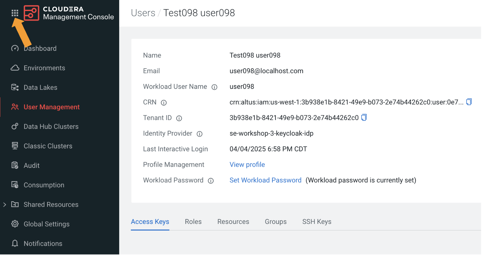
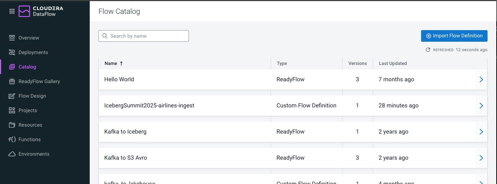

# LAB 01: Ingest data using Apache NiFi

## Overview

In this lab, we will explore using **NiFi** to ingest new data into Iceberg tables. This process can take advantage of the ACID capabilities Iceberg provides, whether it is inserting new data into Iceberg tables or CDC transactions to provid real-time updates without rewriting entire datasets.

# Step-by-Step Guide

## Prerequisites: Setup

As part of the `Prerequisites`, we will walk through the initial setup and configuration steps needed in your environment before you can proceed with this lab.

### Step 1: Login to CDP
1. Go to - https://login.cdpworkshops.cloudera.com/auth/realms/se-workshop-3/protocol/saml/clients/cdp-sso

2. Enter your assigned user-id which should be in the pattern of `user0##`, and the password you were given


   a. You will be logged in to your CDP Home Page
   

   b. You may see a popup asking if you want to try the new User Interface.  For this Lab, click on the `Maybe Later` button
   
   


### Step 2: Setup Workload Password for User

1. Set your CDP Workload Password for user

   a. In your CDP Home Page
   

   b. In the bottom left corner, find your user ID and click on it. In the popup, click on `Profile`
   

   

    c. On the User Profile page, click on `Set Workload Password` link

    

    d. Enter a strong password, confirm it, and click on `Set Workload Password` button
       - Password must be at least 8 characters long.
       - Password must include lower case characters.
       - Password must include upper case characters.
       - Password must include numbers.
       - Password must include symbols ('#', '&', '*', '$', '%', '@', '^', '.', '_', '!').

    

    - You should see a message that the Workload password has been updated.

    

    - Please save or remember the password you entered.  You will need it for `Lab 01`

    - You will be returned to the User Profile page

2. Go back to Main Page
- Click on the 9 square icon in the top left of the page

    

- Select 'Home' from the Menu

    

## Lab 1: Ingest Data using Apache NiFi

In this section of the lab you will deploy a DataFlow that will:

   - Load 3 Iceberg Dimension tables - 'airlines', 'airports', and 'planes' with data that is provided as a static CSV dataset
   - Load a fact table named 'flights' from data that is stored **S3 bucket**.
   - The target database (which is your Data Lakehouse) will be named `**<user0##>_airlines**`
   - This flow will be deployed & executed using **Flow Designer** in a Cloudera AWS Public Cloud environment.

### Step 1: Deploy a NiFi DataFlow to FlowDesigner

1. **Open Cloudera Data Flow**
    - Click on the DataFlow icon to open Cloudera DataFlow.
    

    - You will see the DataFlow Overview page

    
   
    - Once in Cloudera DataFlow you can:
      - Monitor and manage running flows in `Deployments`
      - In `Catalog` you can save & version flows, organize flows, and manage access
      - Create new flows in `Flow Design` powered by Apache NiFi
      - You also have access to the `ReadyFlow Gallery` allowing you to quickly get started with pre-built, end-to-end data flows for common use cases

2. **Go to Catalog**
   - On the left navigation menu click on `Catalog`
   

3. **Create a New Draft of Iceberg-Summit-2025-data-flow**  
   - The `Catalog` is where data flows are stored.
   - This is where you manage the flow definition lifecycle - this includes importing, versioning, deleting, etc.
   - Once you are in the `Catalog` you can see the flows that have been saved.
   

   - In the list, locate the flow named `IcebergSummit2025-airlines-ingest`, and click the arrow to the right of the flow
      

   - A properties page will open showing details for this flow, including the version that are available, where this flow is being used, and other details about the saved flow
      

   - To create a draft of `IcebergSummit2025-airlines-ingest` flow, click the `Create New Draft` button to the middle right of the page
      

   - A wizard will appear allowing you to specify which compute environment to use, which project this should be part of, etc.
      

      - Rename the draft by prepending your `user-id` to the `Draft Name`, similar to below and click the `Create` button.  This example is for user098:
      

   - After clicking on the `Create` button you will be takend directly to the flow Draft and see the canvas for the flow
      

### Step 2: Getting the Flow to Execute

At this point you are now using Apache NiFi to build a flow.

1. **Explore Data Flow**
   - Zoom in on the canvas - to do this you can use the `+` button in the bottom right of the cavas, or you can use your mouse to "scroll" into the canvas.
   

   - To move around on the canvas, move the mouse pointer to a blank area in the canvas, click & hold down your left mouse button and drag the mouse left/right/up/down.

   - For those that have not seen Apache NiFi before, you are probably wondering what the boxes on the cavas are.  These are `Processors` and `Connectors`
      - Processors is a component that is used to listen for incoming data; pull data from external sources; publish data to external sources; route, transform, or extract information
      - Connectors are used to define the path between processors, it acts as a temporary holding area for queued data

   - In the top left of the flow there is a `Processor` named **RawData_airlines_csv** and a `Connector` to the right of this Processor.
   

2. **Start Test Session**
   To ingest data we'll need to start a test session to establish compute to be used for the processing.
   
   - In the top right corner of the page, click the `Flow Options` drop down button
   

   - Under the **Test Session** section, click on the `Start` button:  
   

   - This will open a wizard that allows you to control what compute resources you will allocate.  Click on the `Start Test Session` button
   

   - You will be brought back to the canvas, while this test session starts you will see in the top right an `Initializing Test Session` stataus indicator
   

   - On the wizard screen you took all of the default values.  One was the size of compute being requested.  In our case, this was the X-Small config which will create a compute of 2 vCores, and 4 GB RAM; we could have selected other sizes based on what we were trying to accomplish.

   - Once you see the `Active Test Session` status, you can proceed to the next step.  You can see this is a toggle button. **Don't do this now**, but to stop the test session you can click on the radio button
   

3. **Modify Flow Parameters to use your User ID**
   Now that the Test Session has started we can proceed.  This flow is setup to be flexible and uses `Parameters` to maintain this flexilibity.

   - In the top right corner of the page, click the `Flow Options` drop down button and click on `Parameters`  
   

   - You are taken to the All Parameters page for your flow
   

   - Find the Parameter named `CDP Username`
   

      - Click anywhere on the row of the `CDP Username` on the 
      

      - On the properties page to the right, enter your assigned `user-id` in the **`Value`** box.  This example is for user098:
   

   - Find the Parameter named `CDP Password`
   

      - Click anywhere on the row of the `CDP Password` on the 
      

      - On the properties page to the right, enter your assigned `user-id` in the **`Value`** box.  This example is for user098:
   

   - Click `Apply Changes` button to save your changes
   

   - Click `Ok` button to save your changes
   

4. **Start All Cotroller Services**  
   Controller Services are extension points that provide information for use by other components (such as processors or other controller services). The idea is that, rather than configure this information in every processor that might need it, the controller service provides it for any processor to use as needed.

   - In the top right corner of the page, click the `Flow Options` drop down button and click on `Services`  
   

   - You are taken to the Services page for your flow.  You will see that most of the Services are in a State of **Disabled**
   

   - For each `Service` that is **Diabled** (under `State` you will see the [](img/disabled_icon.png) Disabled icon), enable it as follows:
      - Click anywhere on each Service record, starting with `Flight Data CSVReader`
      

      - Right below the Service name, click the **Enable** button ([](img/enable_service_button.png))
      

      - Repeat above steps for:
      
      
      
      

   - Once completed you should see that all Services are **Enabled** (under `State` you will see the [](img/disabled_icon.png) Enabled icon)
   

   - Return to Flow Designer by clicking on the `Flow Designer` link, which is at the top of the Services page 
   

5. **Start `RawData_airlines_csv` Processor and check output**
   - Move to the top of the Flow by finding the `RawData_airlines_csv` Processor
      - To move around on the canvas, move the mouse pointer to a blank area in the canvas, click & hold down your left mouse button and drag the mouse left/right/up/down.
   

   - Right mouse click on the Processor
   

   - Select `Start` from the menu
   

   - You will see in the status of the Processor change and in the Processor you will see the amount of data that was processed
      - This Processor will read a CSV file that contains Airline Carrier details
   

   - It will write the data to what is called a `FlowFile`.  In the connector you can see the queued FlowFile that temporarily holds the data that is being processed.
   

   - To view the data that is in the FlowFile, right click on the `Connector` and select `List Queue`
   

   - Here you see the list of FlowFiles that have been queued.  At this point there is only 1 FlowFile.  To view contents of the FlowFile:
   

      - Click anywhere on the record
      
      - The FlowFile Attribute page is displayed, showing the properties that are associated with this FlowFile.
      
      - Click on the `Open in Data Viewer` button ([](img/flow_designer_view_airlines_data_button.png))
      

      - You can see the CSV that will be used to load the `airlines` Iceberg table
      

   - Return to `Flow Designer`
      - On your browser close the `Data Viewer` browser tab
      
      - To the right of the tab click the close button ([](img/close_browser_tab.png))
      - You should only have this tab remaining
      
      - Make sure you are on the DataFlow browser tab, and click the `Flow Designer` link at the top of the Data Viewer page
      
      

6. **Start All Processors and monitor progress**  
   - Start all the Processors to load the Data Lakehouse Iceberg tables.  Right click a blank area on the canvas and select `Start`.  This will start all Processors.

   

   - The processors should all start running.  You'll start to see the Processors status start updating and FlowFiles will be moving through the Connectors
   

7. **PutIceberg Processor Configuration**
   - While this is starting to run.  Navigate the canvas to find the `Write_Iceberg_planes` Processor.
   

   - This processor writes data to the `**<user0##>_airlines**`.`planes` Iceberg table (your Data Lakehouse).  Click on the `Write_Iceberg_planes` Processor to open the properties page.
   

   - Let's look at some of the properties for this Processor, scroll down to see the following properties:
      - Catalog Service - is a Service that will be used to provide details where the Data Lakehouse exists
      - Catalog Namespace - this is the Database name (ie. `**<user0##>_airlines**`) where the Data Lakehouse tables exist.  This property is using Parameters, indicated by `#{}`.  Parameters will be used to substitute the value, in this field you can see it is using the value from the Parameter `CDP Username` that you entered in an earlier step.
      - Table Name - the table in this case `planes`
      


### Step 3: Verify Data Ingested Properly into Bronze Layer

1. **Open Cloudera Data Warehouse **  
   - On the left navigation pane click the menu icon
   

   - You will see this in the navigation pane
   

   - Right click on `Data Warehouse`, and select `Open Link in New Tab`
   

   - At the top of your browser window, click on the `CDW` tab that you just opened
   

2. **Open SQL Editor**
   In this step you will use your **user-id** you were assigned to determine which compute environment you will use to open the SQL Editor.

   - On the Data Warehouse landing page, click on the `**Hue**` button in the tile named `odl-is-#` (use the list below to determine which tile to use) to open a new browser tab for the Hive SQL Editor.
      | User-id           | In Stock |
      | :---------------- | :------: |
      | user001-user009   | odl-is   |
      | user010-user019   | odl-is-1 |
      | user020-user029   | odl-is-2 |
      | user030-user039   | odl-is-3 |

   - In this example, the `user-id` is **user005**, so they are opening the SQL Editor for `odl-is`
   

   - This will open a new browser tab named `Hue - Editor`
   


3. **Run some Queries to check results**  
   In this step you will run a few queries to check the status of the data ingestion step.

a. Get metadata details about the `airlines` table
   - Copy/paste the following into the SQL Editor
```
-- Look to see metadata for Iceberg table.  Look for the following properties: 'metadata_location', 'TABLE_TYPE' = 'ICEBERG', and 'location'.
DESCRIBE FORMATTED ${user_id}_airlines.airlines;
```
   

   - In the `user_id` prompt at the bottom of the SQL statment editor enter your assigned `user-id`.  This example is for user098
   

   - Click the `Execute` button ([](img/sql_editor_execute_button.png))

   - In the output check Table properties for the `airlines` Iceberg table.
   

      - Scroll down and look for the following details, you may have to scroll right to see the full value: `Database` (database where table resides), `Location` (location where table data is written), `metadata_location` (location of current metadata), `table_type` (indicating Iceberg table), and `current-snapshot-id` (current snapshot id)
      

b. Preview some records from the `airports` table
   - Clear the previous query from the query editor by selecting the statement and deleting it
      

   - Copy/paste the following into the SQL Editor
```
-- Preview airports table
SELECT * FROM ${user_id}_airlines.airports
LIMIT 10;
```
   

   - Click the `Execute` button ([](img/sql_editor_execute_button.png))

   - In the output check that the results for the `airlines` Iceberg table look correct.
   

c. See how many records are in the `planes` table
   - Clear the previous query from the query editor by selecting the statement and deleting it
      

   - Copy/paste the following into the SQL Editor
```
-- See how many records are in the planes table
SELECT COUNT(*)
FROM ${user_id}_airlines.planes;
```
   

   - Click the `Execute` button ([](img/sql_editor_execute_button.png))

   - In the output check the results for the `planes` Iceberg table.
   

d. Summarize the `flights` table on year & month to see the number of records in each month
   - Clear the previous query from the query editor by selecting the statement and deleting it
      

   - Copy/paste the following into the SQL Editor
```
-- Check the number of recrods in each partition (year) and month of the flights table 
SELECT year, month, COUNT(*) 
FROM ${user_id}_airlines.flights
GROUP BY year, month;
```
   

   - Click the `Execute` button ([](img/sql_editor_execute_button.png))

   - In the output check the results for the `flights` Iceberg table.
   


## Summary

In this lab, you explored how to use Cloudera DataFlow (Apache **NiFi**) for ingesting flight delay and supporting dimension data into several iceberg tables. You configured processors, set up controller services, and used Iceberg to manage the data.

To check the results of the ingestion, you used Cloudera DAta Warehouse to execute some queries to verify the results look good.

