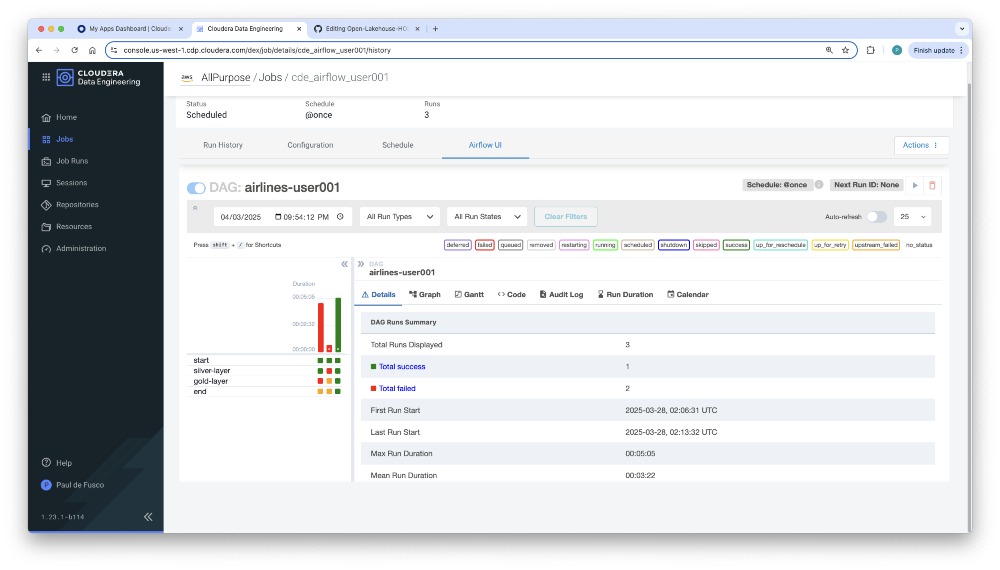

# LAB 02: Transform data using Apache Spark

## Overview

In this lab, we will explore using **Spark** to transform data and ultimately build a simplified Medallion  Data Architecture. Along the way you will learn about how Spark and Iceberg work in concert to power the Open Lakehouse.

## Step-by-Step Guide

### Step 1: Create Silver Spark Job

- This Job will load Flight data for December 1, 2024 from the Bronze Table.
- Four Silver tables will be created for each user: Flights, Planes, Airports and Airlines.
- The Flights Silver table will be loaded with a batch of data for December 2, 2024.
- The batch data will be validated using Great Expectations, a framework for data quality.
- Once the data has been validated, it will be loaded into the Silver table with Iceberg WAP by merging the temporary ingestion branch into the main branch.

1. **Create Silver Job in CDE**  
   - Create a Job of type Spark using the following configurations. Do not run it!
        * Name: ```cde_silver_user0xx``` (modify this with your username).
        * Application File: select the ```001_Lakehouse_Silver.py``` located in the ```Lakehouse_Files``` resource.
        * Arguments: Enter your username here for example ```user0xx```.
        * Python Environment: Select the Python resource ```Python-Shared-Resource```.
        * Apply the following Advanced Options: 1 Initial Executors / 2 Drivers Cores / 4 Executor Cores / 2 Driver Memory / 8 Executor Memory.


### Step 2: Create Gold Spark Job

- Leveraging Iceberg Time Travel, this Job will perform an Incremental Read to efficiently process data that has changed since the last batch load instead of reprocessing the entire dataset.
- Finally, two Gold tables will be created to provide a refined view into the Flights data to power the Enteprise Datawarehouse.

2. **Create Silver Job in CDE**  
   - Create a Job of type Spark using the following configurations. Do not run it!
        * Name: ```cde_silver_user0xx``` (modify this with your username).
        * Application File: select the ```001_Lakehouse_Silver.py``` located in the ```Lakehouse_Files``` resource.
        * Arguments: Enter your username here for example ```user0xx```.
        * Python Environment: Select the Python resource ```Python-Shared-Resource```.
        * Apply the following Advanced Options: 1 Initial Executors / 2 Drivers Cores / 4 Executor Cores / 2 Driver Memory / 8 Executor Memory.


### Step 3: Create Airflow Job

- CDE Virtual Clusters natively support Apache Airflow. In this Airflow Job you will orchestrate the execution of the Spark Silver and Gold jobs.

3a. **Create Airflow Job in CDE using Airflow Editor**  
   - Option A: Create the Airflow Job Definition in the Editor.
        * Drag and drop two CDE Job instances into the Canvas.
        * Configure each instance by selecting the Silver and Gold Jobs.
        * Run the Job


3b. **Create Airflow Job in CDE using Airflow DAG**  
   - Option B: Create the Airflow Job Definition.
        * Open the ```003_Airflow_Orch.py``` script in your local editor and add your username at line 50.
        * Create a CDE Job of type Airflow and select the Application File by uploading your edited script to a Files resource.



