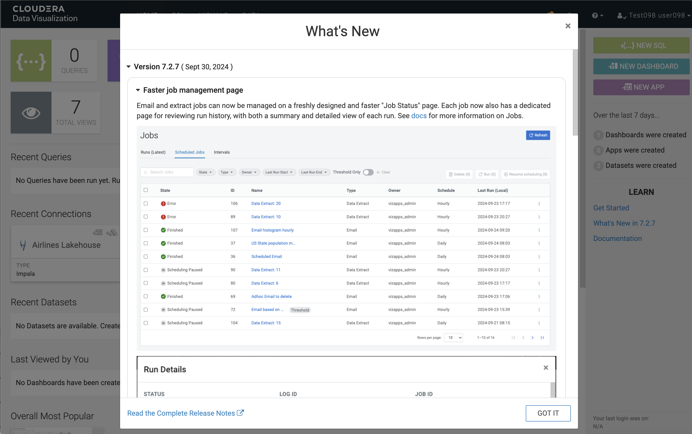

# LAB 03: Analyze data using Apache Hive/Impala

## Overview

In this lab, we will explore data using **Cloudera Data Warehouse** SQL Editor and **Cloudera DataViz** . This is how a Business Analyst can interact with data stored in Iceberg tables using charts and graphs instead of having to enter SQL statements.

## Step-by-Step Guide

### Step 1: Run Analytic Query & Time Travel Query

In the Lab execises you will be asked to:
   - Write a SQL to answer a burning business question for our project.  You will do this using Apache Hive.
   - Use the same SQL to use the Time Travel feature of Iceberg to see the data as it looked after the first data load.  You will do this using Apache Hive.
   - Open a Dasboard to answer some other burning business questions.  The Dashboard will be sending SQL to Apache Impala to return results.

1. **Return to Data Warehouse SQL Editor**

   a. Open SQL Editor browser tab
   - At the top of your browser window, click on the `CDW` tab that you just opened
   

   **OR**

   b. Return to Cloudera Data Warehouse and Open SQL Editor
   - On the left navigation pane click the menu icon
   

   - You will see this in the navigation pane
   

   - Right click on `Data Warehouse`, and select `Open Link in New Tab`
   

   - At the top of your browser window, click on the `CDW` tab that you just opened
   

   - In this example, the `user-id` is **user005**, so they are opening the SQL Editor for `odl-is` (return to Lab 1 if you are unsure which tile to use)
   

   - This will open a new browser tab named `Hue - Editor`
   

2. **Answer the question: Which airline carrier should we partner with for this program?**
   - Clear the previous query from the query editor by selecting the statement and deleting it
 
   - Copy/paste the following into the SQL Editor
```
-- Which Airline Carrier should we partner with?
SELECT 
   uniquecarrier, 
   AVG(depdelay) AS avg_dep_delay,
   COUNT(CASE WHEN depdelay > 30 THEN 1 ELSE 0 END) AS num_delayed_flights
FROM ${user_id}_airlines.flights
LEFT OUTER JOIN ${user_id}_airlines.airlines
   ON flights.uniquecarrier = airlines.code
GROUP BY uniquecarrier
ORDER BY num_delayed_flights DESC;
```
   

   - Click the `Execute` button ([](img/sql_editor_execute_button.png))

   - From this list it looks like there are serveral airline carriers that we could partner with for this program.  In the returned result you can see that there are 6 airlines returned.
   


3. **What did the data look like before this last load? - Time Travel**  
   - History (snapshots)
     ```
     SELECT * FROM ${user_id}_airlines.flights.history;
     ```
     

     - Click the `Execute` button ([](img/sql_editor_execute_button.png))

       - Capture previous snapshot - in the results under the column `flights.snapshot_id`, locate the value for the snapshot prior to the current snapshot.  This will be the value to use to do a Time Travel
      

   - Time Travel:  
      - Clear the previous query from the query editor by selecting the statement and deleting it
      

      - Copy/paste the following into the SQL Editor
        ```
        SELECT 
           uniquecarrier, 
           AVG(depdelay) AS avg_dep_delay,
           COUNT(CASE WHEN depdelay > 30 THEN 1 ELSE 0 END) AS num_delayed_flights
        FROM ${user_id}_airlines.flights
          FOR SYSTEM_VERSION AS OF ${snapshot_id}
        LEFT OUTER JOIN ${user_id}_airlines.airlines
           ON flights.uniquecarrier = airlines.code
        GROUP BY uniquecarrier
        ORDER BY num_delayed_flights DESC;
        ```
        

        - In the `snapshot_id` prompt box copy paste the saved Snapshot from the previous step
        

        - Click the `Execute` button ([](img/sql_editor_execute_button.png))

   - Doing the Time Travel results in only 2 carriers with results vs. 6 from the current snapshot.  This was done with a simple syntax addition `FOR SYSTEM_VERSION AS OF ...` to allow for viewing results from a previous snapshot
   

### Step 2: Use Dashboard to answer questions

1. **Return to Data Warehouse**  
   - At the top of your browser window, click on the `CDW` tab that you just opened
   

2. **Launch Cloudera DataViz**  
   - On the left navigation pane, select `Data Vizualization`
   

   - Click the `Data VIZ` button on the row for  `odl-airlines-dataviz` to launch DataViz
   

   - You will see a 'What's New' page
   
        - Click the `GOT IT` button ([](img/dataviz_got_it_button.png))

3. **Open `Duty Free Dashboard`**
   - Data Visualization main page - 
   

   - There are 4 areas of DataViz - HOME, SQL, VISUALS, DATA - these are the tabs at the top of the screen in the black bar to the right of the Cloudera Data Visualization banner

     - HOME - this is the starting point; it shows some statistics at the top, followed by some quick access details to recent content - Queries, Connections, Datasets, and Dashboards.  Which is the default landing page
     - SQL - allows you to manually build queries against data to perform quick discovery against the data.  Below is an example of a query that was built and Run
     

     - VISUALS - an area for viewing/building/modifying visuals, dashboards, and applications
     

     - DATA - interface for access to datasets (aka: metadata model) image below, connections, and the Connection Explorer
     

   - For today's Lab we will concentrate on opening a Dashboard named `Duty Free Dashboard`.  There are many ways to open this dashboard.  Select the tile `Duty Free Dashboard` under `Overall Most Popular`
   

   - This opens the `Duty Free Dashboard`
   

4. **Analyze Engine Types**
   - For our project it would be interesting to determine if there are other factors that contribute to delayed flights.  This could help us become more proactive is sending out emails based on other details about a flight, including information on plane manufacturer, engine type, etc.

   - Let's first look at Engine Type.  Hoover over the Pie Chart slice that has no words in the slice.  You can see the Engine Type is NULL, meaning this information was not available for some of the planes
   

  - It would make sense to exclude this from the Dashboard.  To do this:
    - At the top of the Dashboard, you will see prompts that can be used to filter the dashboard
   

  - To exclude Null values you can select the down arrow next to **(All)** under `Engine Type` prompt, then select the option for `Include NULLs` to toggle it off.  This will exclude Null Engine Types
  

   - After exlcuding Nulls all dashboard visualizations are updating reflecting the selection
   

5. **Analyze Originating Airport (where did the flight start)**

   - One of the airports that we are planning to partner with is Chicago O'Hare (airport code ORD).
     - Use the Origin prompt to select `ORD`
     - First: select the down arrow next to the **(All)** under the Origin prompt
     - Second: enter your search term, in this case enter `ord` then click on the magnifying glass icon
     - Third: Select `ORD` in the returned results
       - This is a multi-select, so you could continue to choose additional airports by entering in a new search or scrolling through the list to select other airports
   


   - After selecting `ORD` the dashboard is updated to show results where the flight started in Chicago O'Hare.

   

   - Important Note: each time you select/change a prompt it is sending a query to Apache Impala and executing the query against the Iceberg tables you have previously been working on.  This is important as it shows the performance of the query engine leveraging Apache Iceberg tables.

   - We could continue the analysis to determine when it would be best to send an offer to our Duty Free store based on various factors.

6. **[Time Permitting] Explore other Prompts, Visuals, etc.**
   - Feel free to spend a little time navigating around in the Dashboard by applying different fliters like changing the slider `Distance` prompt or hoovering over other visuals like the `Correlation Code by Manufacturer`
   
   

## Summary

In this Lab, we explored how to use **Cloudera Data Warehouse (Hive/Impala)** for querying flight data to answer burning business questions and for taking advantage of one of the superpowers of Apache Iceberg, Time Travel.

