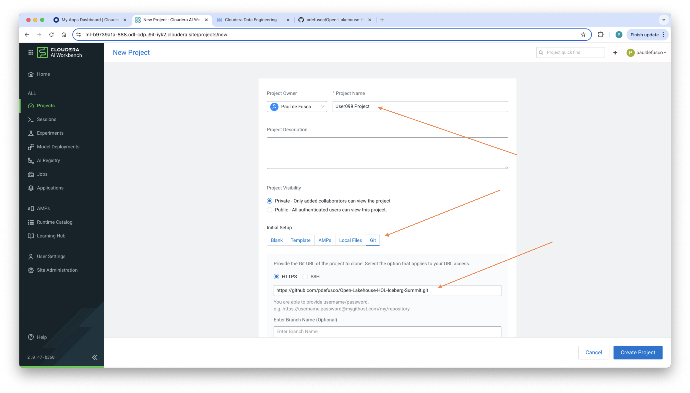
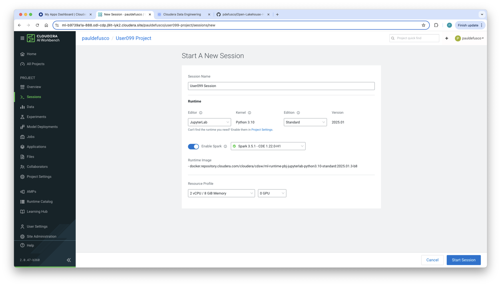
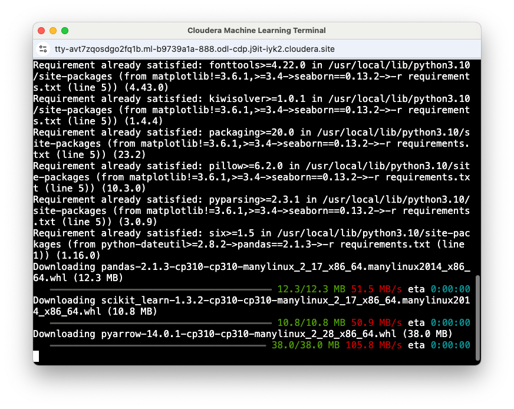
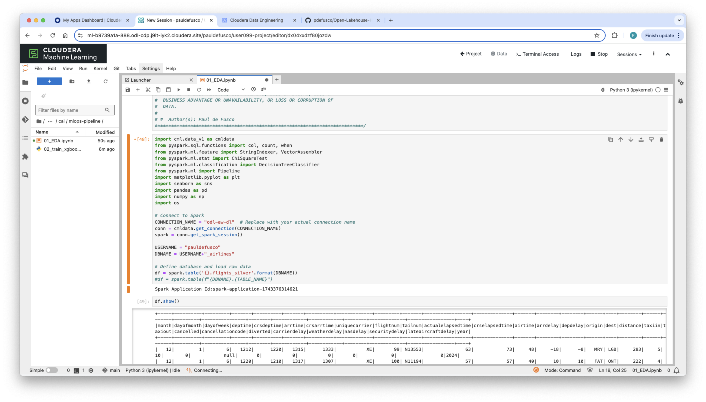
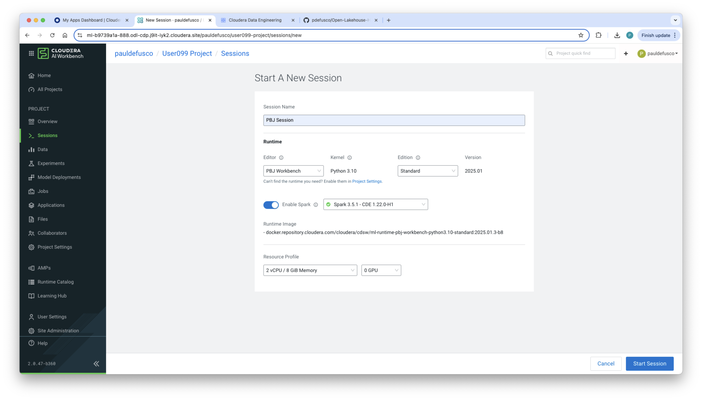
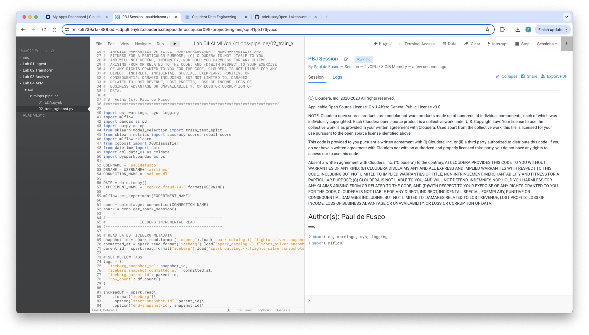
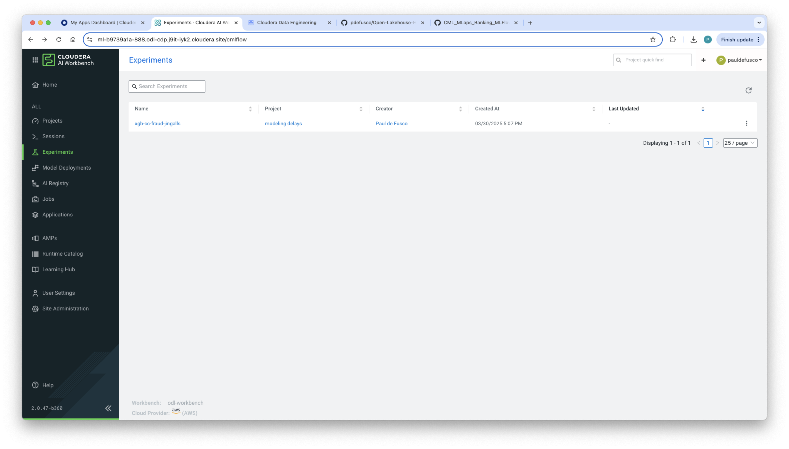
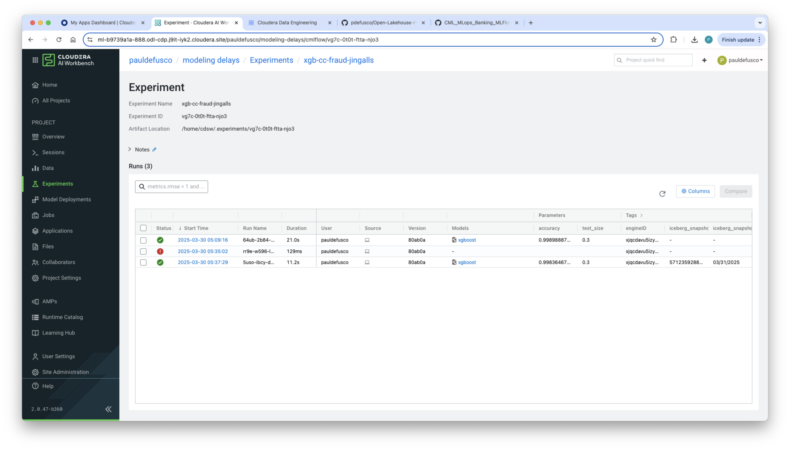
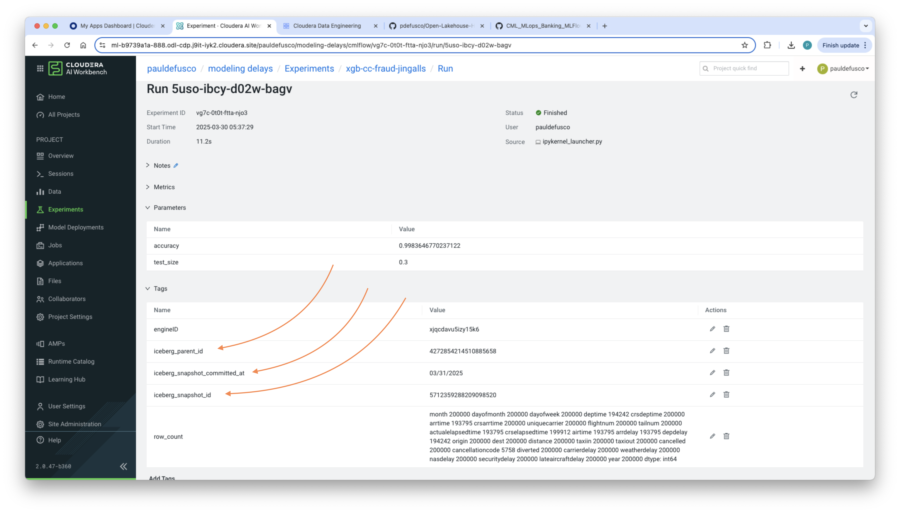

# LAB 04: AI:ML

## Overview

In this lab, we will explore using **MLFlow and XGBoost** to predict diverted flights. In the process you will leverage MLFlow Tracking to log Iceberg Metadata and enhance MLOps lineage.

## Step-by-Step Guide

### Step 1: Explore Flights Data with a JupyterLab Session

- This notebook will allow you to familiarize yourself with the Flights data.
- The data is read from the Silver Flights table. A variety of diagrams are created with Seaborn and other Python libs.

1. **Run the Data Exploration Notebook**  
   - Create a CAI Project by cloning the GitHub project.
   - Launch a CAI Session with the following Resource Profile.
        * Editor: JupyterLab
        * Kernel: Python 3.10
        * Edition: Standard
        * Version: 2025.01
        * Enable Spark: Spark 3.5.1
        * Resource Profile: 2 vCPU / 4 Gb Memory / 0 GPU
    - Install the requirements by opening the terminal and running ```pip install -r requirements.txt```
    - Add your username in the first cell. Then run each cell. No code changes are needed.









### Step 2: Log an XGBoost Model with MLFlow

- Leveraging Iceberg Time Travel, this XGBoost training and hyperparameter tuning script will perform an Incremental Read to efficiently train on data that has changed since the last batch load instead of reprocessing the entire dataset.
- Finally, an Experiment is logged to MLFlow Tracking. The MLFlow Experiment will include Iceberg metadata.

**Run the XGBoost Training Script**  
   - Launch a new CAI Session with the same Resource Profile but PBJ Runtime Editor.
   - Add your username and then run the whole script.
   - Validate the XGBoost Experiment and Iceberg Metadata in the MLFlow Tracking UI.










